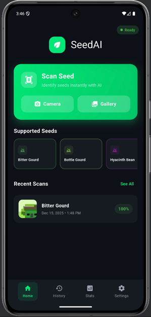
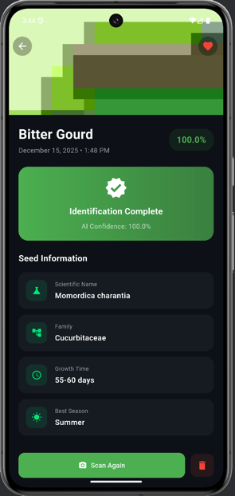
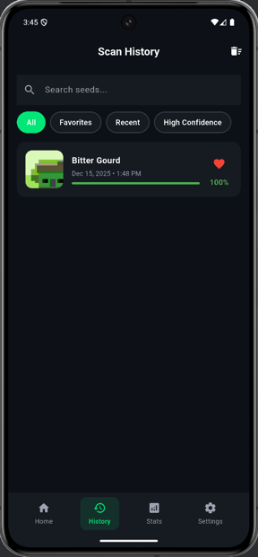
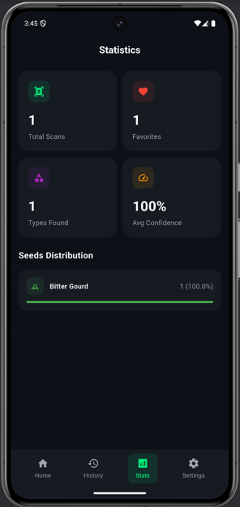
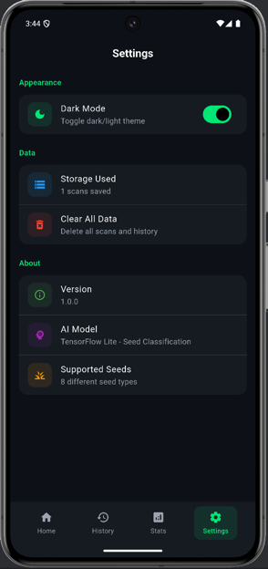

```markdown
# 🌱 SeedAI – AI-Powered Seed Classifier

SeedAI is a modern Flutter application that uses a TensorFlow Lite model to classify different types of seeds from images.  
It features a polished multi-screen UI, local history, statistics, and dark/light themes, built with **GetX** for state management.

---

## 📷 Screenshots

All screenshots are stored in the `screenshots` directory of this project:

- `screenshots/home.png`
- `screenshots/scan.png`
- `screenshots/history.png`
- `screenshots/stats.png`
- `screenshots/settings.png`

```text
screenshots/
  home.png
  scan.png
  history.png
  stats.png
  settings.png
```

Embedded in the README:

<p align="center">
  
  
</p>

<p align="center">
  
  
</p>

<p align="center">
  
</p>

If you change screenshot filenames, update the paths above accordingly.

---

## ✨ Features

- 📸 **AI Seed Classification**
    - Capture an image using the camera or choose from the gallery
    - On-device TensorFlow Lite inference (no backend or internet required)

- 🧠 **Modern AI App UI**
    - Multi-tab navigation: **Home**, **History**, **Statistics**, **Settings**
    - Material 3 design, smooth transitions, Hero animations
    - Light and Dark mode support

- 🕒 **Scan History (Local Storage)**
    - All scans stored locally using **GetStorage**
    - View recent scans on Home screen
    - Full history list with:
        - Search by seed name
        - Filters: **All**, **Favorites**, **Recent**, **High Confidence**
        - Swipe-to-delete individual scans
        - Mark/unmark scans as favorites

- 📊 **Statistics Dashboard**
    - Total scans
    - Favorites count
    - Unique seed types found
    - Average model confidence
    - Distribution of seed types (progress bars)

- ⚙️ **Settings**
    - Dark/Light theme toggle
    - Show number of saved scans
    - Clear all data (history + local images)
    - App & model info

- 🌾 **Seed Details**
    - For each classified seed:
        - Scientific name
        - Botanical family
        - Typical growth time
        - Best season
        - Clear confidence indicators

---

## 🧩 Tech Stack

- **Framework**: Flutter (Material 3)
- **State Management & DI**: GetX
- **Local Storage**: GetStorage
- **Model Inference**: TensorFlow Lite (`tflite_flutter`)
- **Image Handling**: `image_picker`, `image`
- **File System**: `path_provider`
- **Formatting**: `intl`
- **IDs**: `uuid`

---

## 🏗 Project Structure

High-level folder structure:

```text
lib/
├── main.dart
├── app/
│   ├── app.dart
│   ├── bindings/
│   └── routes/
├── core/
│   ├── constants/
│   ├── theme/
│   └── utils/
├── data/
│   ├── models/
│   └── services/
└── presentation/
    ├── controllers/
    ├── screens/
    └── widgets/
```

Conceptually:

- **app/** – App root, routes, and (optional) bindings
- **core/** – Shared constants, themes, and helpers
- **data/** – Models and services (storage, classifier/TFLite)
- **presentation/** – UI: screens, controllers (GetX), and reusable widgets

---

## 🚀 Getting Started

### 1. Prerequisites

- Flutter SDK (3.x recommended)
- Android Studio / VS Code or another Flutter-capable IDE
- For Android: Android SDK
- For iOS: Xcode (on macOS)

Check Flutter installation:

```bash
flutter doctor
```

### 2. Clone the Repository

```bash
git clone https://github.com/your-username/seed_ai.git
cd seed_ai
```

Replace `your-username` with your actual GitHub username when you push.

### 3. Install Dependencies

```bash
flutter pub get
```

### 4. Add the TFLite Model

Place your TensorFlow Lite model file in the `assets` folder.  
Expected path (matching the current code):

```text
assets/seed_data.tflite
```

Update your `pubspec.yaml`:

```yaml
flutter:
  uses-material-design: true

  assets:
    - assets/seed_data.tflite
```

If your model file has a different name or path, update it in:

```dart
// lib/data/services/classifier_service.dart
_interpreter = await Interpreter.fromAsset('assets/seed_data.tflite');
```

Make sure the number and order of classes in your model output match the labels defined in:

```dart
// lib/core/constants/seed_data.dart
static const List<String> labels = [
  'Bitter Gourd',
  'Bottle Gourd',
  'Hyacinth Bean',
  'Malabar Spinach Seeds',
  'Okra Seeds',
  'String Beans',
  'Sunflower Seeds',
  'Watermelon Seeds',
];
```

### 5. Run the App

Android:

```bash
flutter run -d android
```

iOS:

```bash
flutter run -d ios
```

TFLite with this setup is intended for mobile (Android/iOS), not web.

---

## ⚙️ Platform Permissions

### Android

In `android/app/src/main/AndroidManifest.xml`, ensure these permissions:

```xml
<uses-permission android:name="android.permission.CAMERA"/>
<uses-permission android:name="android.permission.READ_EXTERNAL_STORAGE"/>
<uses-permission android:name="android.permission.WRITE_EXTERNAL_STORAGE"/>
```

And your `<application>` tag should look like:

```xml
<application
    android:name="${applicationName}"
    android:label="SeedAI"
    android:icon="@mipmap/ic_launcher">
    ...
</application>
```

### iOS

In `ios/Runner/Info.plist`, add:

```xml
<key>NSCameraUsageDescription</key>
<string>This app uses the camera to capture seed images for classification.</string>
<key>NSPhotoLibraryUsageDescription</key>
<string>This app accesses the photo library to select seed images for classification.</string>
```

---

## 🎯 How to Use the App

1. **Open the app**
    - Default screen is **Home** with the scan card and supported seeds.

2. **Scan a seed**
    - Tap **Camera** to take a photo.
    - Or **Gallery** to choose an existing image.
    - Wait for the AI to classify the seed.
    - You will be redirected to the **Result Detail** screen automatically.

3. **View details**
    - On the result screen, see:
        - Seed label and confidence
        - Scientific name, family, growth time, and season
        - Option to mark as favorite (heart icon)
        - Buttons to **Scan Again** (camera) or **Delete** the scan

4. **History**
    - Switch to the **History** tab:
        - Search seeds by name
        - Filter: All, Favorites, Recent, High Confidence
        - Swipe left to delete individual items

5. **Statistics**
    - Switch to the **Stats** tab:
        - Total scans, favorites, types found, average confidence
        - Seed distribution by type with colored progress bars

6. **Settings**
    - Switch to the **Settings** tab:
        - Toggle dark/light theme
        - See how many scans are stored
        - Clear all data (including images saved to app storage)
        - See version, model info, and supported seeds count

---

## 🧱 Architecture Notes

- **State Management**
    - `HistoryController`
        - Manages scan history, filters (All/Favorites/Recent/High Confidence), and statistics.
    - `ClassifierController`
        - Handles picking images (camera/gallery), saving to storage, and calling the classifier.
    - `ThemeController`
        - Manages dark/light mode and persists preference.
    - `NavigationController`
        - Manages bottom navigation tab index.

- **Services**
    - `StorageService` (GetStorage)
        - Persists scan history list.
        - Persists theme preference (dark/light).
    - `ClassifierService` (TFLite)
        - Loads the TFLite model once.
        - Handles image preprocessing and running inference.

- **Data Model**
    - `ScanResult`
        - `id` (uuid)
        - `label`
        - `confidence`
        - `imagePath` (local path in app documents directory)
        - `timestamp`
        - `isFavorite`

---

## 🧪 Testing

Basic smoke test:

```bash
flutter test
```

You can add tests for:

- History filtering logic (All/Favorites/Recent/High Confidence).
- Theme toggling behavior.
- Navigation behavior (e.g., bottom nav index changes).

---

## 📦 Building Release APK (Android)

```bash
flutter build apk --release
```

Generated APK will be in:

```text
build/app/outputs/flutter-apk/app-release.apk
```

---

## 🔁 Updating Screenshots

1. Run the app on a device/emulator.
2. Open each screen:
    - Home
    - Scan / Classification (before/after scanning)
    - History
    - Statistics
    - Settings
3. Take screenshots and save them into the `screenshots` folder with these names:
    - `home.png`
    - `scan.png`
    - `history.png`
    - `stats.png`
    - `settings.png`
4. Commit them with the project so they show in the README on GitHub.

---

## 🧾 License

Add your chosen license here. Example:

```text
MIT License

Copyright (c) 2024 ...

Permission is hereby granted, free of charge, to any person obtaining a copy
...
```

---

## 🙋 FAQ

**Q: How do I change the supported seeds or add more?**  
Edit `lib/core/constants/seed_data.dart`:

- Update `SeedData.labels` list to match the order and count of your model output.
- Update or add entries in `SeedData.info` for new labels (with color, scientific name, etc.).

**Q: My model filename or path is different. What do I do?**  
Update:
- `pubspec.yaml` `assets:` section.
- `lib/data/services/classifier_service.dart` in `loadModel()`.

**Q: History filters are not working or updating?**  
Ensure:
- You are using the latest `HistoryController` logic with `Rx`/`Obx`.
- `filteredHistory` is used inside an `Obx` in `HistoryScreen`.

---

Made with Flutter, GetX, and TensorFlow Lite.
```